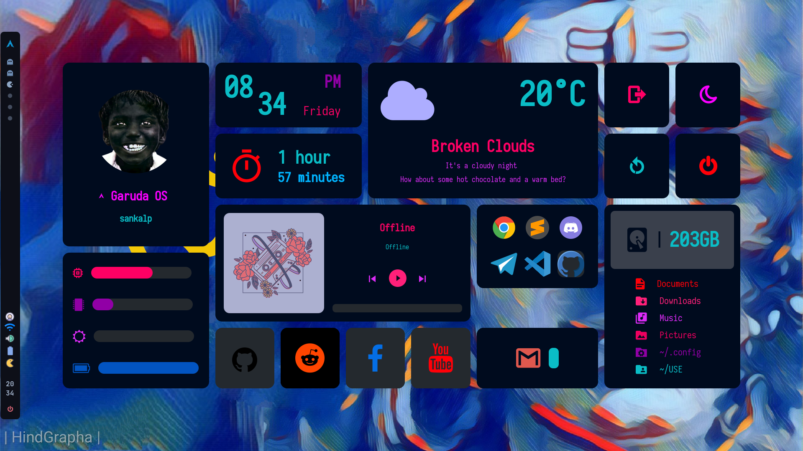

# BSPWM | Polybar themes collection with Theme Selector. I didn't rice this. I only Modified.

## 🌿 Information
12 different themes for BSPWM and Polybar. With a theme selector to change on the fly. 

## I will only maintain Z0mbi3

## Rice Menu


|DIstro|[Arch](https://archlinux.org/)|
|:---:|:---:|
|WM|[BSPWM](https://github.com/baskerville/bspwm)|
|Bar|[Polybar](https://github.com/polybar/polybar)|
|Menu|[Rofi](https://github.com/davatorium/rofi)|
|Compositor|[Picom](https://archlinux.org/packages/community/x86_64/picom/)|
|Terminal|[Alacritty](https://aur.archlinux.org/termite.git)|
|Widgets|[ElKowars wacky widgets ](https://github.com/elkowar/eww)|
|Browser|[Firefox](https://www.mozilla.org/firefox/) & [Google-Chrome](https://www.google.com/chrome)|

## 🚀 Features
* **Change themes on the fly:** 12 different Rices now!.

* **Theme Selector:** <code>Super + Shift + Space bar</code> to launch it.

* **Random wallpaper:**  Every time you switch between rices or reload bspwm with <code>super + alt + r</code> a new wallpaper is set depending on the rice you are on.

* **Wallpaper Changer** <code>Super + Alt + w</code> changes bethween different wallpapers in the actual rice.

* **Hide / Unhide Bar:** If you needit you can hide bars

* **Change transparency on the fly:** 
Increase and decrease transparency in focused or selected window.


## 🎨 The themes...
So yes... i called the Rices with the names of some of my ex girlfriends. 

### 🌸Emilia:

- Color Palette: <code>Tokyo Night</code>

||


### 🌸Jan

- Color Palette: <code>Cyber Punk</code>

||


### 🌸Aline

- Color Palette: <code>Catppuccin Frappe</code>

||


### 🌸Andrea

- Color Palette: <code>Holly molly i dont know..</code>

||


### 🌸Cynthia

- Color Palette: <code>[u/gabrielzschmitz](https://www.reddit.com/user/gabrielzschmitz/)</code>

||


### 🌸Isabel

- Color Palette: <code>One Dark</code>

||


### 🌸Silvia

- Color Palette: <code>GruvBox</code>

||


### 🌸Melissa

- Color Palette: <code>Nord</code>

||


### 🌸Pamela

- Color Palette: <code>[elenapan](https://github.com/elenapan/dotfiles)</code>

||


### 🌸Cristina

- Color palette - <code>[Rose Pine](https://github.com/rose-pine)</code>
- Main Wall - <code>[ElRastaOk](https://www.reddit.com/r/unixporn/comments/w5p7s0/hyprland_my_cute_desktop/)</code>

||


### 🌸Karla

- Color palette - <code>No author</code>

||


### 🌸z0mbi3:

- Color Palette: <code>Decay</code>
- With Tray icon!!

||


#### 🚀New Dashboard
||


## Very useful keybindigs to know...

- <code>shift + super + @space</code> Display menu to select theme selector.
- <code>alt + @space</code> Apps Menu.
- <code>super + h </code> Hides bar/s <code>super + u</code> unhide bar/s
- <code>Print</code> Takes screenshot.
- <code>ctrl + alt {plus,minus,t}</code> Changes transparency on focused window.
- <code>ctrl + alt + p</code> Power off computer. <code>ctrl + alt + r</code> Restart computer.
- <code>super + x</code> Open a terminal.
- <code>Alt + x</code> Open a floating terminal.
- <code>ctrl + q</code> Brute Kill a window/process.
- <code>super + alt + w</code> Changes randomly wallpaper.
- <code>super + ctrl + r</code> Restart bspwm.
- <code>super + w</code> WifiMenu
- <code>super + F1 </code> Keybind Help.
- <code>alt + shift + e </code> Rofi Emoji.
- <code> alt + shift + {a,d} </code> Switch Workspace.

And more.. You need to look sxhkdrc file for more.

## 📦 setup

### 💾 Installation:
I will only provide instructions for arch based distributions.

<b>1. First of all we need yay and git</b>

```sh
pacman -S --needed git base-devel && git clone https://aur.archlinux.org/yay.git && cd yay && makepkg -si
```

<b>2. Install Dependencies: </b>

A one time command to install most of these dependencies with your **favorite AUR Helper** (we just install yay).

```sh
yay -S bspwm polybar sxhkd eww dunst rofi lsd jq checkupdates-aur picom ueberzug zsh \
playerctl mpd ncmpcpp mpc picom-arian8j2-git xtitle  betterlockscreen \
ttf-jetbrains-mono nerd-fonts-jetbrains-mono ttf-terminus-nerd ttf-inconsolata \
ttf-joypixels nerd-fonts-cozette-ttf scientifica-font \
feh maim pamixer libwebp webp-pixbuf-loader xorg-xkill papirus-icon-theme lf
```

<b>3. Cloning Dotfiles & Installing:</b>
```sh
git clone --depth=1 https://github.com/S4NKALP/dotfiles.git

# ⚠️ Backuupp!! your filess!!!
[ -e ~/.config/bspwm ] && mv ~/.config/bspwm ~/.config/bspwm-backup-"$(date +%Y.%m.%d-%H.%M.%S)"

# Moving new files to .config
cd dotfiles
cp -r config/bspwm ~/.config/bspwm
# Those were the important ones. You still need to move the remaining directories in config to your ~/.config directory.

# Move Fonts and the other stuff
cp -r misc/fonts/* ~/.local/share/fonts/
cp -r misc/bin ~/.local/
cp -r misc/applications ~/.local/share/
cp -r misc/asciiart ~/.local/share/
fc-cache -rv

# You probably MUST use your own .zsh config, but if you want to use mine, do;
cp -r home/.zshrc ~/.zshrc
cp -r config/zsh ~/.config/zsh

# If you will not use my zsh config, just add to your .zshrc file, this;
if [ -d "$HOME/.local/bin" ] ;
  then PATH="$HOME/.local/bin:$PATH"
fi
```

<b>4. Enabling Services</b>
```sh
# For automatically launching mpd on login
systemctl --user enable mpd.service
systemctl --user start mpd.service
```
## Some tips

* Wallpapers are in .webp image format, i added libwebp webp-pixbuf-loader packages for your filemanager (thunar in my case) have the capacity to show webp thumbnails.
* If u dont wanna use the random wallpapers comment line 194 and uncomment line 195 from /home/YourUser/.config/bspwm/scripts/LaunchWorld file.
* Left click in pacman updates module in polybar to update. Right click for show updates available only.

## Troubleshooting
* **Bspwm Scripts or Launchers not responding**

The proper execute permissions on some files should be maintained when you download/clone and copy to your directories, but if not just run the following line by line.
```sh
chmod +x ~/.config/bspwm/bspwmrc
chown $USER ~/.config/bspwm/rice.cfg
chmod +x ~/.config/bspwm/scripts/{external_rules,getSongDuration,music,RandomWall,hu-polybar,LaunchWorld,RiceSelector,screenshoter,updates.sh,WeatherMini}

# In Cristina, Pamela, Andrea & z0mbi3 Rices, you need to give execution permissions to the shell scripts too.

chmod +x ~/.config/bspwm/rices/pamela/widgets/{calendar,calendarlauncher,mplayer-launcher,power-launcher,profile-sys-launcher}
chmod +x ~/.config/bspwm/rices/andrea/arin/sidedar/toggle_sidebar
chmod +x ~/.config/bspwm/rices/andrea/arin/scripts/{battery,check-network,music_info,quotes,sys_info,system,volume.sh,widget_apps,widget_search}
chmod +x ~/.config/bspwm/rices/cristina/widgets/mplayer-launcher
chmod +x ~/.config/bspwm/rices/z0mbi3/bar/scripts/{battery,calendar,popup,volume.sh,wifi,workspace}
chmod +x ~/.config/bspwm/rices/z0mbi3/dashboard/LaunchInfoCenter.sh
chmod +x ~/.config/bspwm/rices/z0mbi3/dashboard/scripts/weather
```
* **Weather module is showing wrong values**

Yes the values are in my city "Kohalpur" you need to edit ~/.config/bspwm/scripts/WeatherMini to set your city
In line 3 you will find this line weather=$(curl -s wttr.in/**Kohalpur**?format=3) You need to write your city, or postal code, please refer to the [wttr.in Help](https://wttr.in/:help)

For the eww widget in z0mbi3 rice you need to edit ~/.config/bspwm/rices/z0mbi3/dashboard/scripts/weather in line 13 you need to change the ID for the ID of your city, you can get it from [openweathermap](https://openweathermap.org/)


## Credits

All workflows where i stole things to inspire me or for editing, its impossile to remember all but here someones:
- [turquoise-hexagon](https://github.com/turquoise-hexagon/fonts) for his beautiful Banana font.
- [This post](https://www.reddit.com/r/unixporn/comments/vkcasz/i3gaps_i_prefer_light_mode/) by TheMonkeyLlama i saw it in UnixPorn. Who inspired Aline's Rice.
- [adi1090x](https://github.com/adi1090x/widgets) The master, for his setup in Andrea's Rice and for his beautiful Rofi menus.
- [gabrielzschmitz](https://github.com/gabrielzschmitz) For the amazing color palette in Cynthia's Rice. I loose link but im pretty sure he is the owner.
- In Pamela's rice to [elenapan](https://github.com/elenapan/dotfiles) For his beautiful color palette. For the eww widgets to the master [rxyhn](https://github.com/rxyhn/bspdots) and [okklol](https://github.com/okklol/eww-bar).
- Eww doesn't have a way of using a system tray but this little polybar hack make the trick. Thanks to [ikz87](https://github.com/ikz87).

## modification:
- Modification of z0mbi3 rice's bar 
- Modification with zombie theme
- Removed termite and added alacritty
