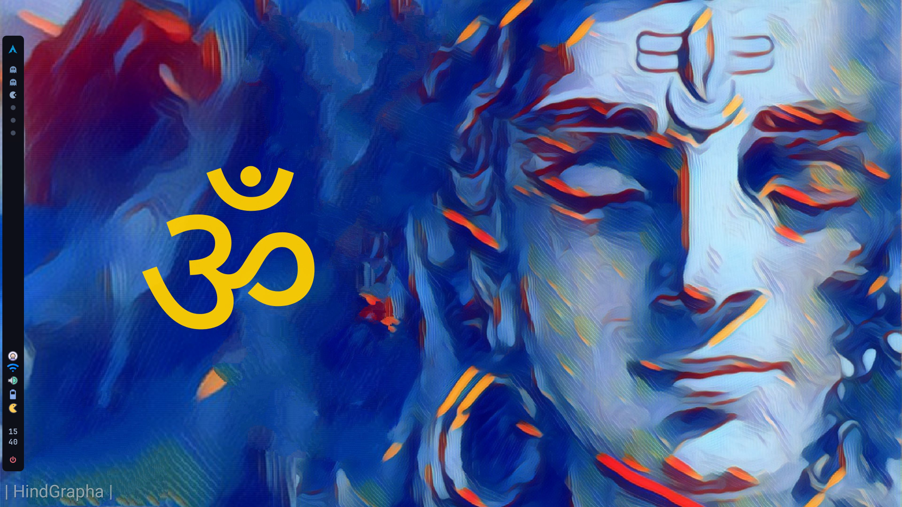

# BSPWM | Polybar themes collection with Theme Selector

## 🌿 Information
12 different themes for BSPWM and Polybar. With a theme selector to change on the fly. 

## Highly modified Only Z0mbi3
##Only Z0mbi3 will be maintain.

## Rice Menu


|DIstro|[Arch](https://archlinux.org/)|
|:---:|:---:|
|WM|[BSPWM](https://github.com/baskerville/bspwm)|
|Bar|[Polybar](https://github.com/polybar/polybar)|
|Menu|[Rofi](https://github.com/davatorium/rofi)|
|Compositor|[Picom](https://archlinux.org/packages/community/x86_64/picom/)|
|Terminal|[Termite](https://aur.archlinux.org/termite.git)|
|Widgets|[ElKowars wacky widgets ](https://github.com/elkowar/eww)|

## 🚀 Features
* **Change themes on the fly:** 12 different Rices now!.

* **Theme Selector:** <code>Super + Shift + Space bar</code> to launch it.

* **Random wallpaper:**  Every time you switch between rices or reload bspwm with <code>super + alt + r</code> a new wallpaper is set depending on the rice you are on.

* **Wallpaper Changer** <code>Super + Alt + w</code> changes bethween different wallpapers in the actual rice.

* **Hide / Unhide Bar:** If you needit you can hide bars

* **Change transparency on the fly:** 
Increase and decrease transparency in focused or selected window.


## 🎨 The themes...
So yes... i called the Rices with the names of some of my ex girlfriends. 

### 🌸Emilia:

- Color Palette: <code>Tokyo Night</code>

||


### 🌸Jan

- Color Palette: <code>Cyber Punk</code>

||


### 🌸Aline

- Color Palette: <code>Catppuccin Frappe</code>

||


### 🌸Andrea

- Color Palette: <code>Holly molly i dont know..</code>

||


### 🌸Cynthia

- Color Palette: <code>[u/gabrielzschmitz](https://www.reddit.com/user/gabrielzschmitz/)</code>

||


### 🌸Isabel

- Color Palette: <code>One Dark</code>

||


### 🌸Silvia

- Color Palette: <code>GruvBox</code>

||


### 🌸Melissa

- Color Palette: <code>Nord</code>

||


### 🌸Pamela

- Color Palette: <code>[elenapan](https://github.com/elenapan/dotfiles)</code>

||


### 🌸Cristina

- Color palette - <code>[Rose Pine](https://github.com/rose-pine)</code>
- Main Wall - <code>[ElRastaOk](https://www.reddit.com/r/unixporn/comments/w5p7s0/hyprland_my_cute_desktop/)</code>

||


### 🌸Karla

- Color palette - <code>No author</code>

||


### 🌸z0mbi3:

- Color Palette: <code>Decay</code>
- With Tray icon!!

||


## Very useful keybindigs to know...

- <code>shift + super + @space</code> Display menu to select theme selector.
- <code>alt + @space</code> Apps Menu.
- <code>super + h </code> Hides bar/s <code>super + u</code> unhide bar/s
- <code>Print</code> Takes screenshot.
- <code>ctrl + alt {plus,minus,t}</code> Changes transparency on focused window.
- <code>ctrl + alt + p</code> Power off computer. <code>ctrl + alt + r</code> Restart computer.
- <code>super + x</code> Open a terminal.
- <code>Alt + x</code> Open a floating terminal.
- <code>ctrl + q</code> Brute Kill a window/process.
- <code>super + alt + w</code> Changes randomly wallpaper.
- <code>super + ctrl + r</code> Restart bspwm.
- <code>super + w</code> WifiMenu
- <code>super + F1 </code> Keybind Help.
- <code>alt + shift + e </code> Rofi Emoji.
- <code> alt + shift + {a,d} </code> Switch Workspace.

And more.. You need to look sxhkdrc file for more.

## 📦 setup

### 💾 Installation:
The installer only works for **ARCH** Linux, and based distros.

<b>Open a terminal in HOME</b>
- **First download the installer**
```sh
curl https://raw.githubusercontent.com/S4NKALP/dotfiles/master/RiceInstaller -o $HOME/RiceInstaller
```
- **Now give it execute permissions**
```sh
chmod +x RiceInstaller
```
- **Finally run the installer**
```sh
./RiceInstaller
```


## Some tips


* If u dont wanna use the random wallpapers comment line 214 and uncomment line 215 from /home/YourUser/.config/bspwm/scripts/LaunchWorld file.
* Left click in pacman updates module in polybar to update. Right click for show updates available only.

## Troubleshooting
* **Weather module is showing wrong values**

Yes the values are in my city "Kohalpur" you need to edit ~/.config/bspwm/scripts/WeatherMini to set your city
In line 3 you will find this line weather=$(curl -s wttr.in/**Kohalpur**?format=3) You need to write your city, or postal code, please refer to the [wttr.in Help](https://wttr.in/:help)

For the eww widget in z0mbi3 rice you need to edit ~/.config/bspwm/scripts/weather in line 12 you need to change the name of your city, you can get it from [openweathermap](https://openweathermap.org/)


## Credits
- [gh0stzk](https://github.com/gh0stzk/dotfiles), [turquoise-hexagon](https://github.com/turquoise-hexagon/fonts), [adi1090x](https://github.com/adi1090x/widgets), [gabrielzschmitz](https://github.com/gabrielzschmitz), [elenapan](https://github.com/elenapan/dotfiles), [rxyhn](https://github.com/rxyhn/bspdots), [okklol](https://github.com/okklol/eww-bar), [ikz87](https://github.com/ikz87).
